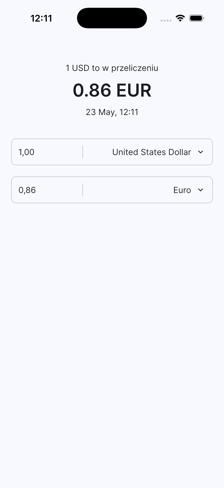

# Currency Converter

A Flutter application for converting currencies using real-time exchange rates.  
The app supports bidirectional conversion, allowing users to enter either the source or target amount and instantly calculate the corresponding value.

---

## Features

- Real-time currency exchange rates
- Bidirectional currency conversion
- Support for multiple currencies
- Currency selection with currency codes
- Automatic rounding to 2 decimal places
- Form validation
- Clean and responsive UI
- Reactive form handling
- Exchange rate timestamp display (UTC)

---

## Screenshots



---

## Getting Started

### Requirements

- Flutter SDK
- Dart SDK
- Android Studio / VS Code
- Internet connection (for exchange rate API)

---

### 1. Registration

Create an account and generate your own API key on the official website:

https://www.exchangerate-api.com

---

### 2. API Key Configuration

In the project code, find the interceptor configuration:

```dart
void setupInterceptors() {
  inject<Dio>(instanceName: ExchangerateHttpClient)
      .interceptors
      .add(AuthInterceptor(key: 'YOUR_API_KEY'));
}
```

Replace:

```dart
'YOUR_API_KEY'
```

with your own API key:

```dart
void setupInterceptors() {
  inject<Dio>(instanceName: ExchangerateHttpClient)
      .interceptors
      .add(AuthInterceptor(key: 'abc123xyz'));
}
```

---
## Technologies Used

- Flutter
- Dart
- Bloc / Cubit
- Reactive Forms
- REST API
- Equatable

---


## Author

Created as a Flutter project focused on financial utility applications.

---

## License

This project is licensed under the MIT License.